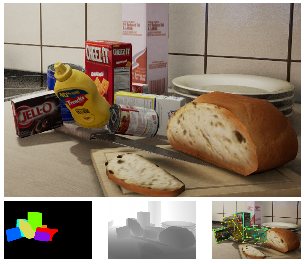

Overview
========

**NDDS** is a UE4 plugin from NVIDIA to empower computer vision researchers to export high-quality synthetic images with metadata. NDDS supports images, segmentation, depth, object pose, bounding box, keypoints, and custom stencils. In addition to the exporter, the plugin includes different components for generating highly randomized images. This randomization includes lighting, objects, camera position, poses, textures, and distractors, as well as camera path following, and so forth. Together, these components allow researchers to easily create randomized scenes for training deep neural networks.

_Example of an image generated using NDDS, along with ground truth segmentation, depth, and object poses._

Downloading
-----------
This repository uses gitLFS:

> **First, install git LFS (large file storage):** https://git-lfs.github.com/ 

For further details, please see https://github.com/NVIDIA/Dataset_Synthesizer/blob/master/Documentation/NDDS.pdf

Motivation
----------
Training and testing deep learning systems is an expensive and involved task due to the need for hand-labeled data. This is problematic when the task demands expert knowledge or not-so-obvious annotations (e.g., 3D bounding box vertices).  In order to overcome these limitations we have been exploring the use of simulators for generating labeled data. We have shown in [1,2] that highly randomized synthetic data can be used to train computer vision systems for real-world applications, thus showing successful domain transfer.

Citation
--------
If you use this tool in a research project, please cite as follows:
> \@article{to2018ndds,  Author = {Thang To, Jonathan Tremblay, Duncan McKay, Yukie Yamaguchi, Kirby Leung, Adrian Balanon, Jia Cheng, Stan Birchfield},  url= {https://github.com/NVIDIA/Dataset_Synthesizer},  Title = {NDDS: NVIDIA Deep Learning Dataset Synthesizer},  Year = {2018} }

References
----------
[1] J. Tremblay, T. To, A. Molchanov, S. Tyree, J. Kautz, S. Birchfield. Synthetically Trained Neural Networks for Learning Human-Readable Plans from Real-World Demonstrations. In International Conference on Robotics and Automation (ICRA), 2018.

[2] J. Tremblay, T. To, S. Birchfield.  Falling Things:  A Synthetic Dataset for 3D Object Detection and Pose Estimation.  CVPR Workshop on Real World Challenges and New Benchmarks for Deep Learning in Robotic Vision, 2018.